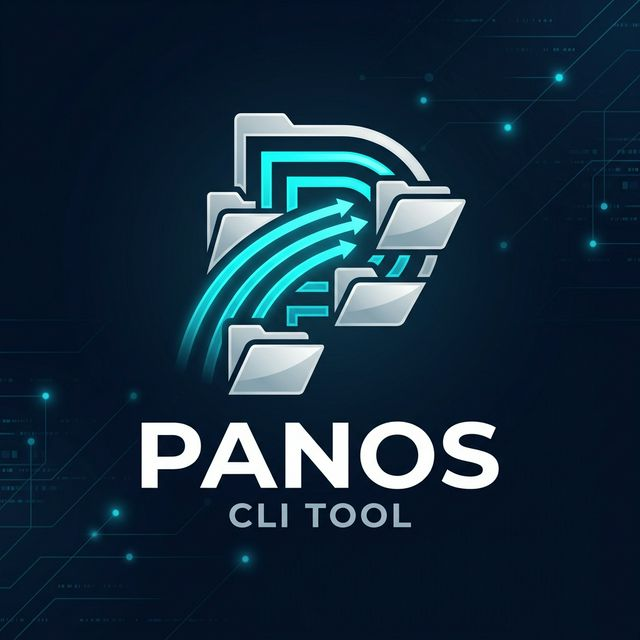

# 🌌 PANOS: Universal File Organizer OS

<p align="center">
  
</p>

[](https://www.rust-lang.org/)
[](https://opensource.org/licenses/GPL-3.0)
[](https://GitHub.com/Nonbangkok/panos/graphs/commit-activity)

**PANOS** is a high-performance, rule-based CLI file management tool engineered for speed and reliability. It transforms cluttered directories into perfectly structured hierarchies using a "set-and-forget" automation approach.

---

## ✨ Features

- ⚡ **Lightning Fast**: High-performance directory traversal using `WalkDir` and pre-compiled glob patterns for O(1) matching speed during execution.
- 📐 **Intelligent Rule Engine**: Support for both extension-based sorting and complex glob pattern matching (e.g., `Invoice_*.pdf`).
- 🧪 **Safety First**: Comprehensive `--dry-run` mode and intelligent conflict resolution (automatic suffixing) to prevent data loss.
- 🔄 **Watch Mode**: Real-time daemonized monitoring using `notify`, automatically organizing files as they appear.
- ⏪ **Smart Undo**: Session-based undo functionality with **parallelized restoration** using `Rayon` for ultra-fast reversal of operations.
- 🧹 **Trash System**: Specialized handling for temporary files (`.tmp`, `.crdownload`, `.cache`), moving them to a dedicated `.panos_trash` for safe review.
- 🌳 **Deep Clean**: Recursive removal of empty directories after organization to keep your filesystem pristine.

---

## 🚀 Quick Start

### Build from Source

```bash
# Clone the repository
git clone https://github.com/Nonbangkok/panos.git
cd panos

# Build for release
cargo build --release
```

### Basic Usage

```bash
# Run organization based on default panos.toml
./target/release/panos

# Preview changes without moving files
./target/release/panos --dry-run

# Watch a directory for changes and organize in real-time
./target/release/panos --watch --source ~/Downloads

# Undo the last organization session
./target/release/panos --undo
```

---

## 🛠 Configuration (`panos.toml`)

PANOS uses a simple TOML configuration to define how your files should be handled.

```toml
source_dir = "Downloads"
watch_mode = false # Can be overridden by --watch flag

[[rules]]
name = "Images"
extensions = ["jpg", "jpeg", "png", "gif"]
destination = "Media/Images"

[[rules]]
name = "Documents"
extensions = ["pdf", "docx", "txt"]
patterns = ["Invoice_*", "Report_*"]
destination = "Work/Documents"
```

---

## 🧠 Technical Core

PANOS is built with a focus on **efficiency** and **industrial-grade reliability**:

- **Pre-compiled Regex/Globs**: Patterns are compiled once at startup, ensuring that millions of files can be matched without re-parsing overhead.
- **Parallel Undo Engine**: Leveraging `Rayon`, PANOS restores files concurrently during undo operations, making session reversals instantaneous even for thousands of files.
- **Atomic Operations**: Moves are designed to be as atomic as possible, with robust error recovery if a file is "In Use" or "Permission Denied".
- **Session Logging**: Every organization run logs its actions to a local `.panos_history.json` file, enabling persistent undo capabilities across different sessions.
- **Recursive State-Awareness**: The scanner understands directory depth and ensures that empty branch nodes are pruned only after their children have been processed.

---

## 📂 Project Structure

The project follows a modular Rust architecture for maintainability and scalability:

- **`src/cli/`**: Command-line argument parsing and help template logic using `clap`.
- **`src/config/`**: Configuration management, including loading and parsing `panos.toml`.
- **`src/file_ops/`**: Core filesystem operations (move, delete, history logging).
- **`src/organizer/`**: The "Brain" – high-level scanning logic, watcher implementation, and undo orchestration.
- **`src/rules/`**: Intelligent matching engine for file extensions and patterns.
- **`src/ui/`**: TUI elements and progress reporting using `indicatif`.
- **`src/lib.rs`**: Library entry point exposing core functionality.
- **`src/main.rs`**: CLI binary entry point.

---

## 🏗 Development Guidelines

### Core Principles
- **Safety**: Leverage Rust's ownership model to ensure thread-safety and avoid race conditions.
- **Modularity**: Logic is strictly separated: `file_ops` handles "how", `rules` handles "what".
- **Test-Driven**: Comprehensive integration tests ensure that complex movement scenarios (conflicts, nested dirs, unicode) are handled correctly.

### Contribution Workflow
1. Fork the repository.
2. Create a feature branch: `git checkout -b feature/amazing-feature`.
3. Standardize code style with `cargo fmt`.
4. Ensure all tests pass: `cargo test`.
5. Submit a Pull Request.

---


## 📝 License

This project is licensed under the GPL-3.0 License - see the [LICENSE](LICENSE) file for details.

---

<p align="center">
  <i>PANOS - Organizing the chaos, one file at a time.</i>
</p>
